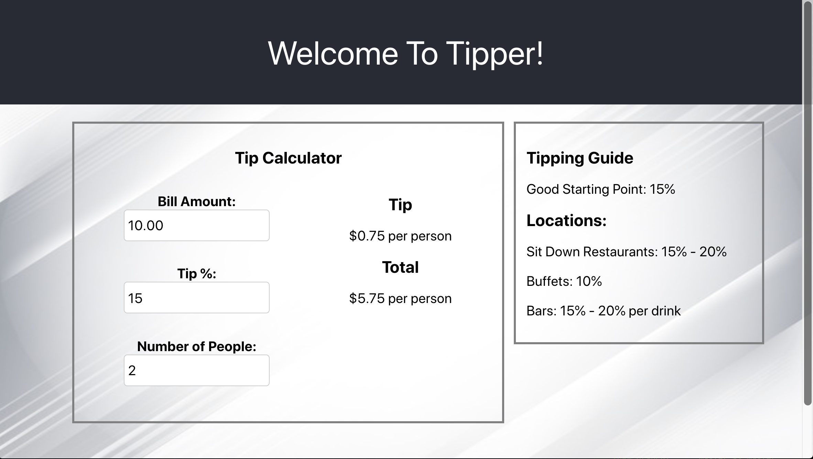

Added Datadog to this project
# Tipper-App

This is a very simple tip calculator application built with React, Javascript, and Heroku. Having a difficult time figuring out how much to tip or how much to split the bill, just use this app to make it easier on yourself. 



# Getting Started 

Site Link: [Tipper-App](https://tipper-app.herokuapp.com/)

Just enter the total bill, tip percentage, and the number of people that bill should be split with and the total will be revealed. 

Note that the app will only calculate the total for positive numbers, so users will get a error message if user types a letter or negative numbers. 

### Prerequisites

Your can access the site from any interest browser including [Google Chrome](https://www.google.com/chrome/), [Firefox](https://www.mozilla.org/en-US/firefox/new/), or [Safari](https://www.apple.com/safari/). 

# Deployment 

This site is deployed through [heroku](https://shout-it-out.herokuapp.com/). 

# Built With 

- React js
- Javascript
- CSS
- Heroku

# Code Sample

```
let tipNum = (parseFloat(this.state.value) * (parseInt(this.state.tip) / 100)) / parseInt(this.state.people) + 0.00;

let tipTotal = parseFloat(tipNum).toFixed(2);

let totalNum = (parseFloat(this.state.value) + (parseFloat(tipTotal) * parseInt(this.state.people))) / parseInt(this.state.people);

let fullTotal;

if (isNaN(totalNum) || totalNum < 0) {
    tipTotal = 'All fields must be positive numbers';
    fullTotal = 'All fields must be positive numbers';
}
```
The code above shows the tip is calculated and then the tip total is used to calculated the total among the people into full total. After we check to see if totalNum is either a negative or is not a number and if that is the case it returns a error message. 

## Author

Muhammad - https://github.com/mawais54013
